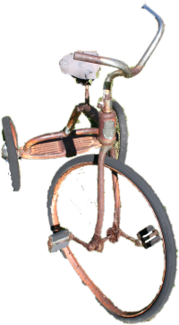

+++
tags = [ "bike",]
date = "2013-10-04 22:25:32-06:00"
aliases = ["hpv.html"]
categories =[]
+++

# Human Powered Vehicles

{:class="img-fluid"}
{:class="img-fluid"}
	
This is more then bicycles.  The conventional bicycle despite advances
in construction and materials has not really improved much in the last
100 years.  This is mostly because of the UCI who sets the defintion
of a bicycle for most races.   A HPV is what happens when we stop
following this forced definition. It also expands from land
into air and water

