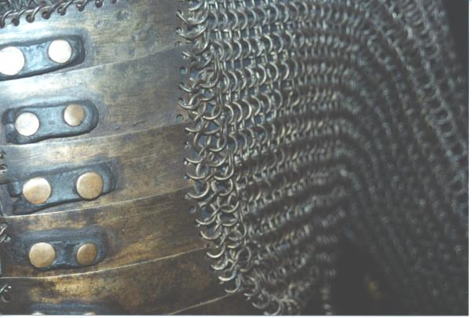

+++
title ="Turkish Armour"
tags = ["metal"]
date = "2013-10-11 11:12:56-06:00"
aliases = ["turkisharmour.html"]
categories = ["main"]
+++

##Armour from the TOPAKAPI musuem in Istanbul
This was labeled as the armour of the sultan's bodygaurd.  The armour is a
combination of 
maille and bands of metal.  The rivited maille had a round cross section except
for the overlapped ends.

[{: class="img-responsive"}](turkishArmour.jpg)
[{: class="img-responsive"}](turkishArmour2.jpg)

