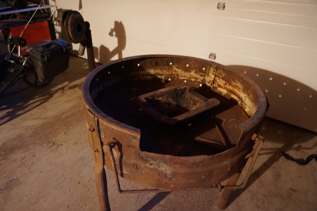

+++
tags = ["metal"]
date = "2017-06-22 07:22:44-06:00"
categories = ["main"]
+++

# Round Forge

I acquired this old forge through the local guild.  It pays to remind people
that you are looking.   This is built inside an old steel tractor wheel. It is
about 36 inches inside diameter.  The blower required some oil, and a handle
nwo it works great.  Now I just need to build a side draft hood for it.
{:class="img-fluid"}
