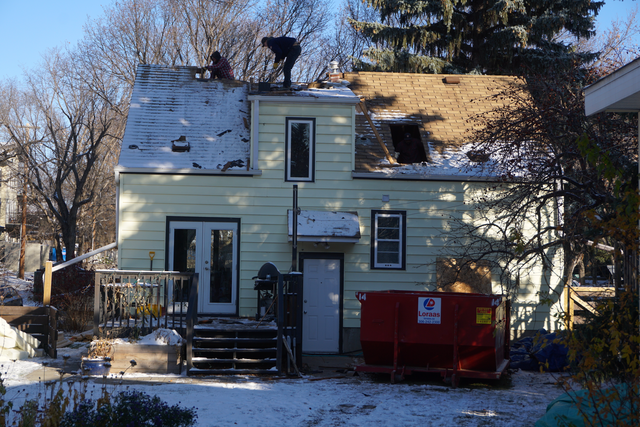
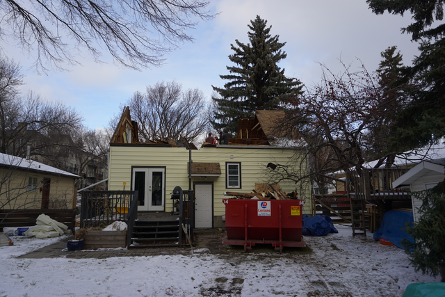
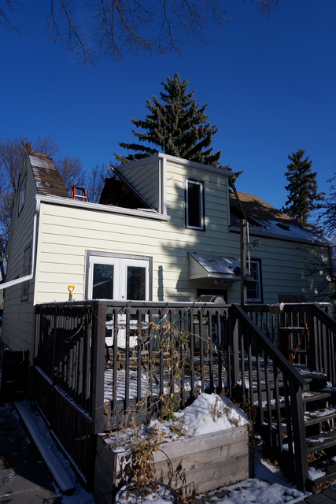
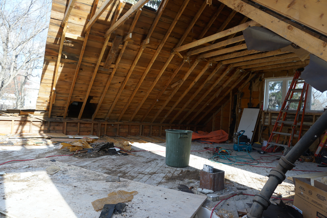
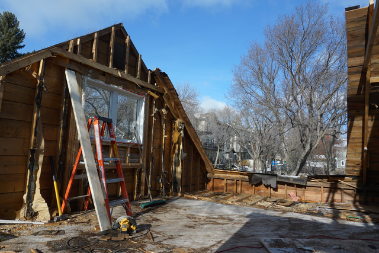

+++
tags = ["house"]
date = "2017-11-02 20:13:00-06:00"
categories = ["main"]
+++

# Roof

{:class="img-fluid"}
{:class="img-fluid"}
{:class="img-fluid"}
{:class="img-fluid"}
{:class="img-fluid"}

