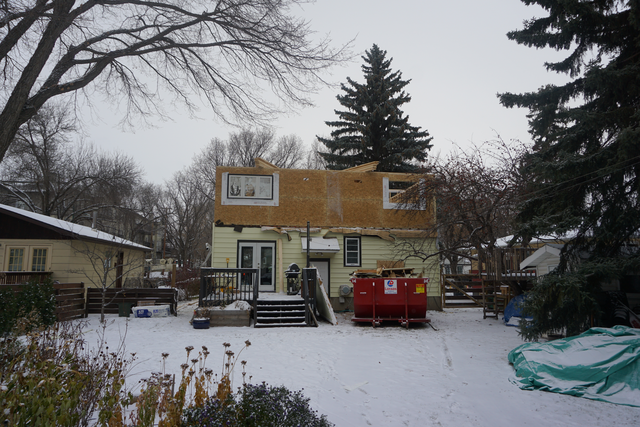
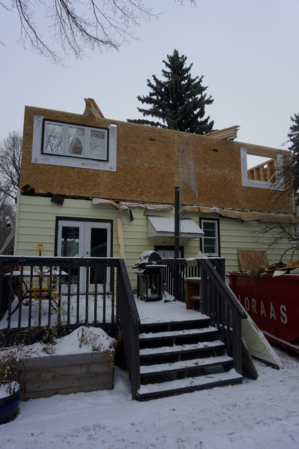
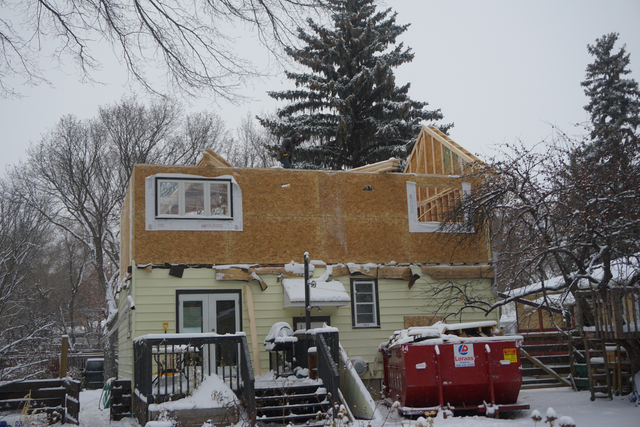
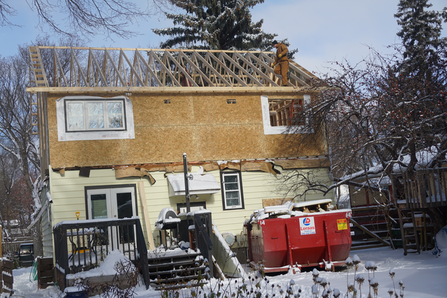
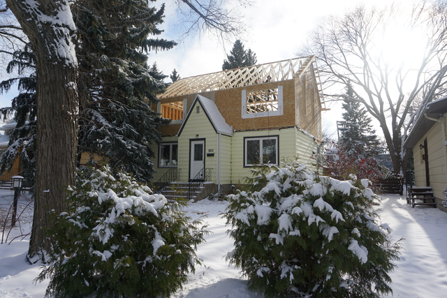
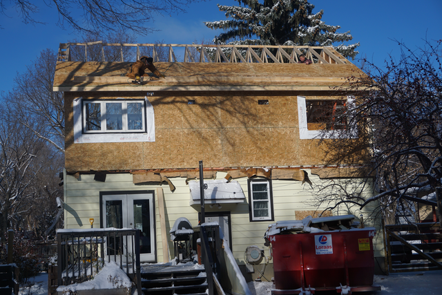

+++
date = "2017-11-04 23:14:18-06:00"
tags = ["house"]
categories = ["main"]
+++

# Second Story

##reconstruction begins.
The walls were pre-assembled on the ground and craned into place. 
The trusses were placed on top.  That is as far as the crew got that day,
so of course it snowed about 10cm.
{:class="img-fluid"}
{:class="img-fluid"}

The next day they started on the trusses. Now it starting to look like a house
again.
{:class="img-fluid"}
{:class="img-fluid"}
{:class="img-fluid"}

The roof sheeting is going up, but it will have to wait until Monday.
{:class="img-fluid"}

