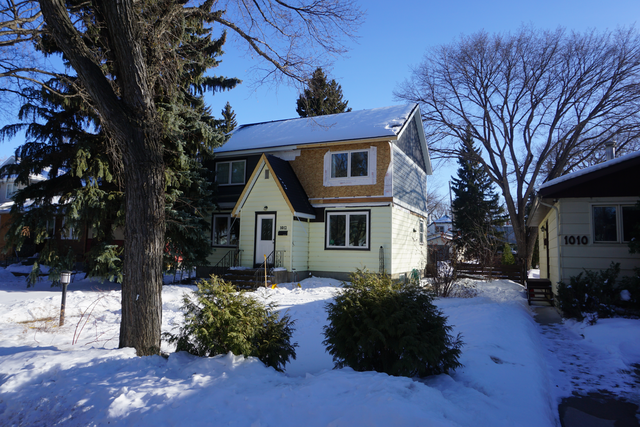
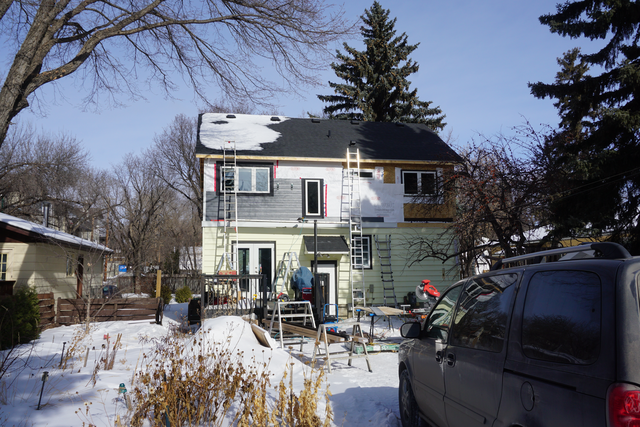

+++
tags = ["house"]
date = "2018-02-01 22:21:54-06:00"
categories = ["main"]
+++

# Almost done (the exterior)

##Siding starting to go on.
Looking more like a house siding is going on. The mismatch between the
grey and the florescent yellow will have to be fixed later when we can afford
to reside the bottom.  

We used a cement board called *hardie board*
[www.jameshardie.ca](https://www.jameshardie.ca)  The colour here is *night
grey*  We decided to breakup the walls a little by use of batten boards and
some white transitions. 

{:class="img-responsive"}
{:class="img-responsive"}

