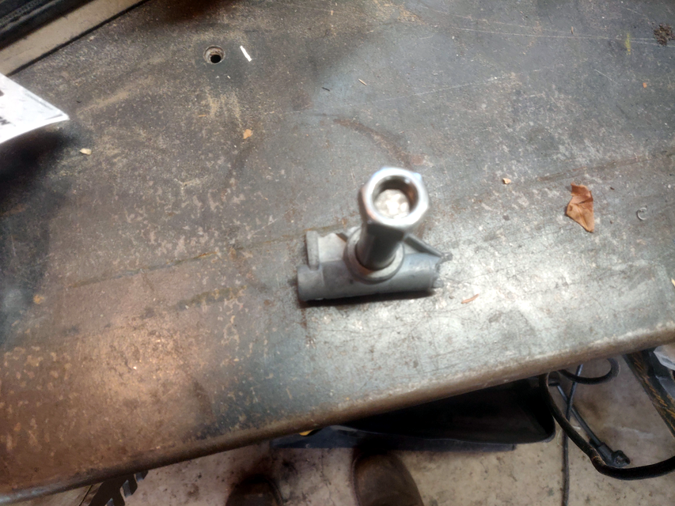
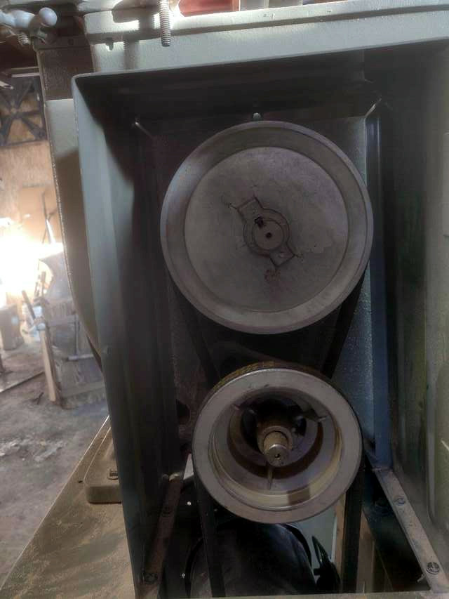

+++
date = "2021-01-30 16:38:58-06:00"
tags = ["metal"]
categories = ["main"]
issue = "1"
+++

# Bandsaw Conversion

## Converting wood bandsaw to cut metal.

I have this old bandsaw that I picked up for next to nothing, it had a broken
mount for the upper wheel.
{:class="figure-img img-fluid rounded"}

I was able to buy a replacement mount, but while a wood bandsaw is nice I
really needed one that would cut steel.  This bandsaw had a multiple belt
reduction  already but it was not slow enough to cut steel.
{:class="img-fluid"}

I switched it to a 3-phase motor and added a VFD.  The VFD not only allows me
to run it 3-phase from single phase but also allows speed control from zero to
what ever your motor will allow.  Mine works from 0 to 120Hz, so I can run it
faster than usual or slow enough to cut metal, all without changing the belt.

Bigger picture of [vfd](bandsaw.png)
 

